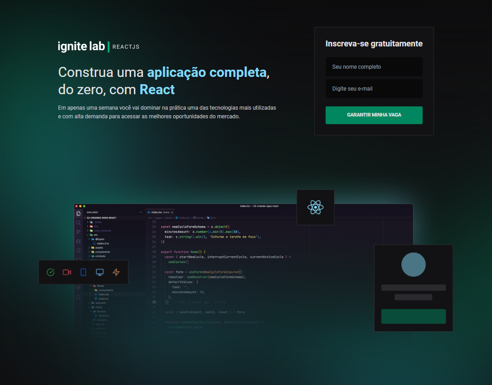
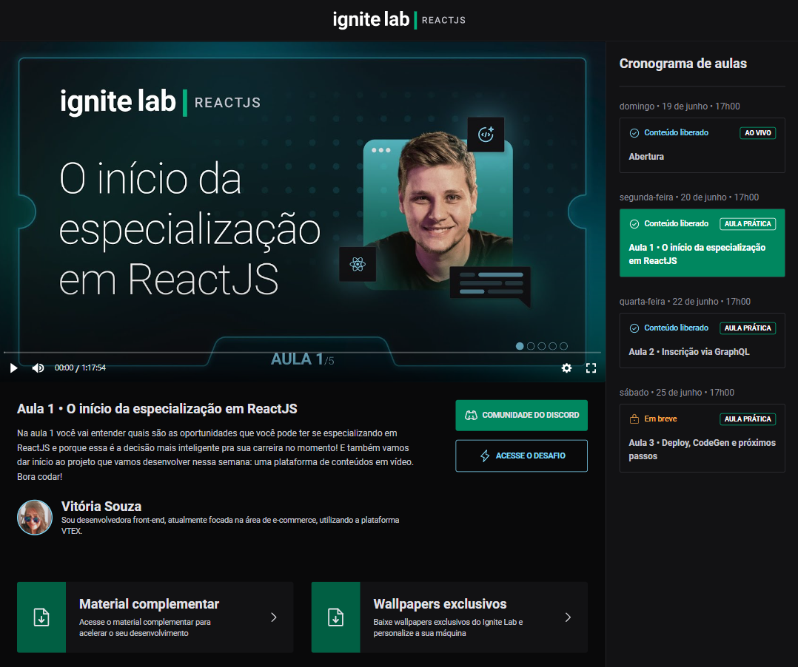

# **Event Platform**

Esse projeto é uma plataforma de evento, onde as pessoas se cadastram na plataforma para ter acesso ao conteúdo de aulas. Essas aulas são liberadas nos dias determinados de cada uma delas que foram cadastradas via admin.

---

## 🚀 **Tecnologias**

Esse projeto foi desenvolvido com as seguintes tecnologias:

- [TypeScript](https://www.typescriptlang.org/)
- [React](https://reactjs.org)
- [Tailwind](https://tailwindui.com/)
- [GraphCMS](https://app.graphcms.com/)
- [GraphQL](https://graphql.org/)
- [Apollo](https://www.apollographql.com/)
- [Vimejs](https://vimejs.com/)
- [GraphQL Code Generator](https://www.graphql-code-generator.com/)

---

## 💻 **Como executar**

- Clone o repositório
- Instale as dependências utilizando `npm install` ou `yarn`

---

## 📚 **Ferramentas, Bibliotecas e Pacotes**

- **Vite:** é uma ferramenta que converte o código para um formato que todos os browsers entendam, ou seja, permite que o navegador entenda o JS mais moderno.

- **Tailwind CSS:** é uma ferramenta de utilitários css, ou seja, várias classes que adicionam estilos nos elementos.

  > Instale as dependencias de desenvolvimento `yarn add tailwindcss postcss autoprefixer -D`

- **Post CSS:** integra de forma automatica junto com o VITE para observar os arquivos css da aplicação e recompilar toda vez que houver alguma alteração. E converte o css de uma maneira que o browser precise consumir o arquivo

**GraphCMS:** é um Headless CMS (Content Management System), ou seja, é um painel de admin (onde os dados são fornecidos através de uma API REST ou GraphQL)

**Apollo:** até podemos realizar a chamada utilizando `fetch` ou `axios`, mas essas ferramentas não são feitas para APIs GraphQL. Tem controles de cache das requisições.

> Instalação: yarn add @apollo/client graphql

Conversão do svg para jsx: [SVG 2 JSX](https://svg2jsx.com/)

**Ícones:** [https://phosphoricons.com/](phosphor-react)

**date-fns**: é uma biblioteca para trabalharmos com datas

**[Vimejs](https://vimejs.com/):** é uma biblioteca para adição de vídeos e os players

> Video.js

**react-router-dom:** é uma biblioteca para lidar com roteamento

**classnames:** é uma lib para colocar condições nas classes do css

**[graphql-code-generator](https://www.graphql-code-generator.com/):** permite termos a integração entre o front-end da aplicação e a API em GraphQL

---

## 📚 **Extensões do VSCode**

- [Tailwind CSS IntelliSense](https://marketplace.visualstudio.com/items?itemName=bradlc.vscode-tailwindcss)
- [PostCSS Language Support](https://marketplace.visualstudio.com/items?itemName=csstools.postcss)
- [GraphQL](https://marketplace.visualstudio.com/items?itemName=GraphQL.vscode-graphql)

---

## ✨ **Deploy**

**Frontend:**: [Vercel](https://vercel.com/)